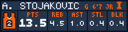
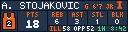
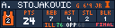

# Athlete Tracker (NCAAB)

Track one men's Division I college basketball player on two consecutive pages. Page 1 always shows the selected player's season averages. Page 2 shows live statistics during a game, then the most recent ESPN final after it ends.

Both pages use the same approved layout as Team Tracker (NCAAB), including the player's name, jersey number, position, height, class, team logo, and PTS/REB/AST/STL/BLK.

## Preview

### Page 1 — Season averages

### Page 2 — Live game

### Page 2 — Final game

## Settings

- **Team + Player:** Search one combined dropdown, then choose the player from that school's current roster. Every selection includes the jersey number; no team, player, or game ID is required.

The app uses ESPN's public basketball data and refreshes every 60 seconds.
