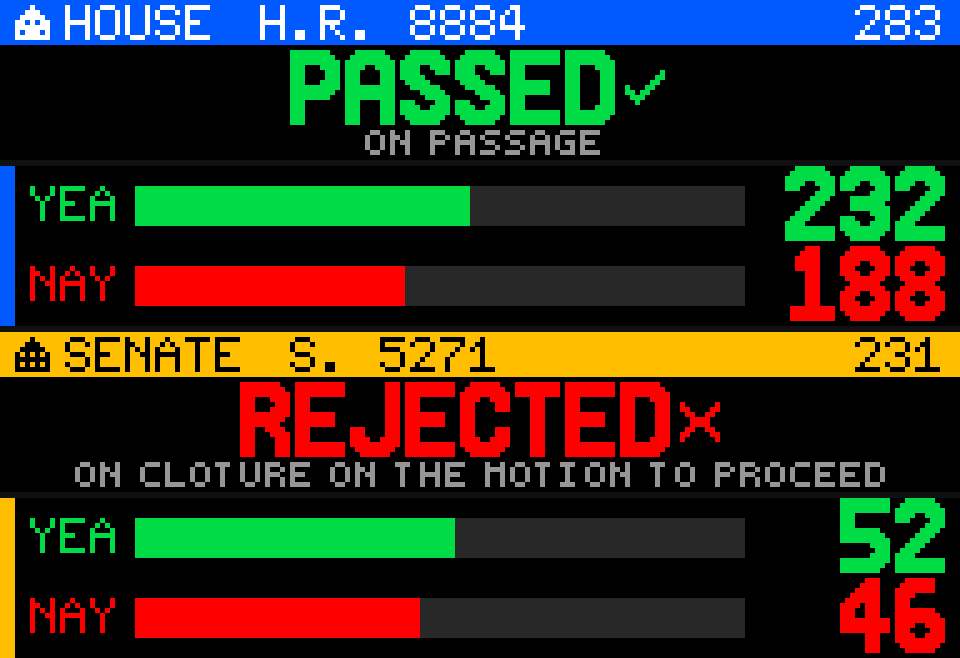

# Capitol Vote

Capitol Vote is a Glance Scroll news app by John McRae. It shows the latest **U.S. House** and **U.S. Senate** roll-call votes on a 192×32 panel, using official Clerk of the House and Senate LIS feeds. No API key is required.



The panel reads like a tiny Capitol Hill scoreboard: chamber header, bill or resolution number, official result, yea/nay bars, and the vote question or title on later frames.

## Preview

From the Glance Developer Network repository:

```powershell
pip install -e .
gdn studio apps/capitol-vote
```

Browser-only preview:

```powershell
gdn preview apps/capitol-vote
```

If `gdn` is not on `PATH`, use `python -m gdn.cli` instead.

## Configuration

| Setting | Default | Notes |
|---------|---------|--------|
| **Chamber** | `Both` | `Both`, `House`, or `Senate` |

- **Both** — House result + House tally, then Senate result + Senate tally.
- **House** — House result, tally, title, then margin (or a close-vote alert).
- **Senate** — the same four frames for the Senate.

Panel size is **192×32**. Refresh is **600 seconds**. Votes are not live-tick data; a few times an hour is enough.

## Pages

| Page | Both | House or Senate only |
|------|------|----------------------|
| **score** | Latest House result | Latest official result for that chamber |
| **tally** | House yea/nay bars | Yea/nay bars |
| **title** | Latest Senate result | Question / measure title, fitted and wrapped |
| **extra** | Senate yea/nay bars | Margin (or **CLOSE VOTE**), raw tally, NV if needed, date/time |

## Display behavior

- The official `vote-result` / `Vote Result` field is the source of truth. Counts are never used to invent Passed or Failed.
- Result posters keep a large outcome word with a simple check or X: `PASSED`, `FAILED`, `AGREED`, `REJECTED`, `CONFIRMED`.
- The vote **question** stays on the result frame so a cloture or nomination result is not mistaken for passage of a bill.
- Tally bars share one scale: each fill is proportional to that side's count over `yea + nay`, with a gutter before the large totals.
- In House-only or Senate-only mode, the title page measures the text and prefers the largest readable font, wrapping to two lines when needed. Common procedural wording is shortened only if that is required to fit.
- Close votes (`|Yea − Nay| ≤ 5`) get an amber outline on the tally and a dedicated **CLOSE VOTE** frame in House/Senate-only mode. The margin (`+1 YEA`) is primary; the raw pair is secondary.
- On a normal margin frame, `+44 YEA` (or `+N NAY`) is primary, `232 - 188` is secondary, `NV` is shown only when needed, and date/time stay small and tertiary.
- House frames use a blue header and House dome mark. Senate frames use an amber header and a slightly different Senate dome mark. The rest of the scoreboard stays the same family.

Display labels are shortened, not rewritten:

| Official wording (examples) | Panel |
|-----------------------------|--------|
| Passed / Bill Passed | PASSED |
| Agreed to / Motion Agreed to | AGREED |
| Confirmed | CONFIRMED |
| Failed | FAILED |
| Rejected / Motion Rejected / Cloture … Rejected | REJECTED |

## Data sources

Official, keyless government publications:

| Chamber | How the latest vote is found | Vote detail |
|---------|------------------------------|-------------|
| **House** | Clerk listing `https://clerk.house.gov/evs/{year}/ROLL_{000\|100\|200}.asp` (newest `rollnumber=` on the highest block that has votes) | `https://clerk.house.gov/evs/{year}/roll{NNN}.xml` |
| **Senate** | LIS menu `vote_menu_{congress}_{session}.xml`, falling back to `.htm` | `vote_{congress}_{session}_{NNNNN}.xml`, falling back to `.htm` |

Congress and session are derived from `ctx.now` (a new Congress convenes 3 January of odd years). House listing year is that session's calendar year. If the current session has no votes yet, the app tries the previous session/year.

## Refresh and caching

- Panel **refresh**: 600 seconds
- Listing/menu HTTP **TTL**: 300 seconds
- Individual vote HTTP **TTL**: 900 seconds

GDN caps uncached `http.get` calls at 8 per render. This app typically uses 2 requests per chamber.

## Errors and empty states

The panel always draws something:

- Network down → `DATA UNAVAILABLE` / `HOUSE FEED DOWN` or `SENATE MENU UNAVAILABLE`
- Empty session → `NO HOUSE VOTES YET` / `NO SENATE VOTES YET`
- One chamber fails in **Both** → that chamber's frames show the fallback; the other chamber still renders
- Missing bill number → `ROLL #n`
- Missing title → question, then bill number

Command-line example:

```powershell
gdn render apps/capitol-vote --input "chamber=Both"
gdn render apps/capitol-vote --input "chamber=House"
gdn render apps/capitol-vote --input "chamber=Senate"
gdn validate apps/capitol-vote
```

## Current technical limitations

- GDN Starlark has **no XML/XPath module**. Tags are read with string finds. That is enough for Clerk/Senate roll-call XML (and Senate HTML if XML returns 500).
- GDN **does not follow HTTP redirects**. House listings must be fetched over `https://clerk.house.gov` (plain `http://` 301s and is dropped).
- Fonts are **uppercase only**. Frames are **still images** (no scroll/animation); the next refresh shows new data.
- Outbound `http.get` times out at 4 seconds and truncates bodies over 1 MB.
- The Clerk's current listing links go to `cgi-bin/vote.asp?rollnumber=`, not `rollNNN.xml`. The app still loads the official XML file once the number is known.
- Party breakdown, member-level votes, and “votes from today only” are not in v1.

## Roadmap

Practical with the same official files — **not built yet**.

- **State / member watch.** House XML `<recorded-vote>` and Senate XML `<members>` include each legislator's name, party, state, and vote. A future `State: Missouri` input could show `HAWLEY YEA` / `SCHMITT NAY` or the House delegation from that state. Member lists are large; v2 should parse only the selected state and keep the 1 MB / 8-request caps in mind.
- Close votes only, or votes from today only
- Vote history, bill watch, nomination-only mode
- Party breakdown on the tally
- Stronger “new vote” emphasis on the next refresh (still-frame; GDN does not animate)

## Accuracy

This app reports what the Clerk and the Senate bill clerk published. It does not infer outcomes from news, models, or raw totals when an official result is present.

## Originality and attribution

The scoreboard layout, chamber marks, page structure, and Starlark drawing code were created for this app. Vote facts come only from official Clerk of the House and Senate LIS publications.

Built for the [Glance Developer Network](https://github.com/glance-led-dev/glance-dev-network).
