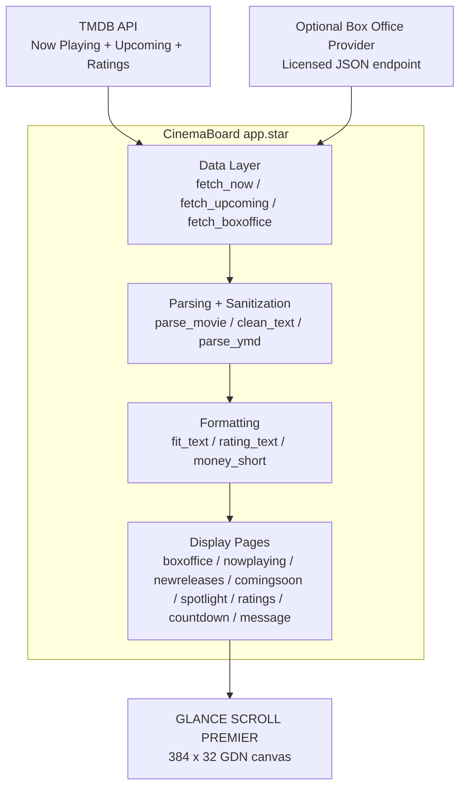

# CinemaBoard Architecture

CinemaBoard is a self-contained GDN/Starlark application. It does not require Flask, Docker, cron, a Raspberry Pi, or a cloud function for the normal TMDB-backed experience.



## Display model

The target hardware is the GLANCE Scroll Premier 8.5 ft model. The current GDN docs state that each LED module is 64 logical pixels wide, height is always 32 px, and chained displays are supported up to 384 px wide. The Premier size corresponds to the six-module maximum, so CinemaBoard uses `width: 384`, `height: 32`.

GDN recommends keeping apps to 192 px or smaller when possible and splitting content across pages for performance. CinemaBoard intentionally uses 384 px because the user specifically targets the Premier and because movie titles benefit from the wider marquee area. The app keeps draw calls low, avoids assets, and uses only a few HTTP requests per page.

## Pages

GDN currently allows up to 8 pages in a scene. CinemaBoard therefore implements the eight core modes as the manifest pages:

1. `boxoffice`
2. `nowplaying`
3. `newreleases`
4. `comingsoon`
5. `spotlight`
6. `ratings`
7. `countdown`
8. `message`

The optional custom theater message defaults off. Because GDN page lists are static, disabled screens are handled at render time: if a page is disabled, it draws the first enabled page instead of showing a broken or blank screen.

## Data layer

`fetch_now()` and `fetch_upcoming()` wrap TMDB endpoints. `fetch_boxoffice()` is separate and reads only an optional JSON URL, so a future licensed provider can be integrated without changing display code.

```text
MovieProvider
  └── TMDBProvider

BoxOfficeProvider
  └── PublicJsonBoxOfficeProvider (optional placeholder for licensed data)
      └── Future: Comscore / The Numbers OpusData / other licensed API adapter
```

## Failure strategy

Every HTTP result is checked before JSON is read. Missing API keys, non-200 statuses, bad JSON, empty lists, malformed dates, missing ratings, and unavailable box-office data all render fallback pages. One provider failure does not prevent other pages from working.

## Caching and refresh

- Manifest `refresh`: `21600` seconds (6 hours).
- TMDB HTTP TTL: `21600` seconds.
- Box-office JSON TTL: `43200` seconds.

Movie lists and release dates are not minute-by-minute data, and these values respect API limits while keeping a home-theater marquee fresh enough for daily use.
