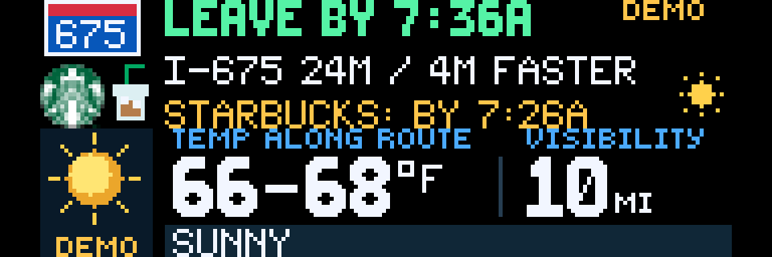

# Commute for Glance Scroll

Live traffic-aware commute estimates, named route signs, an optional stop, leave-by times, weather icons and route-area alerts on a 192 × 32 display.

This app uses your own authenticated Commute service. The companion source and setup instructions are included in [service/SETUP.md](service/SETUP.md). Deploy it on Cloudflare Free using SQLite-backed Durable Objects, configure your provider keys and private trip, then choose Live. No PC needs to stay awake. Cloudflare and traffic-provider free quotas still apply.

## Settings

- **Commute status URL:** your service's hostname and `/status`, such as `example.workers.dev/status`, without `https://`. The app adds HTTPS when requesting data. Full HTTPS URLs remain supported for existing settings and local previews, but colon-free settings are recommended for the device.
- **Commute read key:** your private `READ_KEY`. This API-key field is encrypted by Glance; do not enter a routing provider key here.
- **Display:** Departure (default), Routes or Conditions. The first page is the selected commute view; the second shows route weather.
- **Today's trip:** Direct or Stopover.
- **Arrive by:** Configured, 8 AM, 8.15 AM or 8.30 AM in your configured time zone. The app converts these colon-free choices to the service's existing time format; older saved `08:00`, `08:15` and `08:30` values remain supported.
- **Preview scenario:** Live, or a visibly marked demo. Demos do not use the network.

Your private service holds the home, destination, optional stop and API keys. Stop duration defaults to five minutes. Addresses and stop names are configurable; Starbucks is not required.

## Your addresses and weather

Set `origin.address` and `destination.address` in your own Worker's private `CONFIG_JSON` secret, or use precise latitude/longitude for a parking entrance. Updating that secret recalculates the trip on the next collection; the Glance status URL and read key stay the same. The current Glance settings and companion do not edit addresses. See [step-by-step endpoint setup](service/SETUP.md#set-or-change-the-two-endpoints), including optional stops and route corridors.

**OHGO is optional.** For supported U.S. routes, NWS provides temperature, reported visibility, conditions and severe-weather alerts without an OHGO account or weather API key. Set `alertAreas` to every state your route crosses. The community example defaults to `ohgo: false`; NWS-only weather is treated as normal operation. This is not worldwide weather coverage.

Ohio users can keep `ohgo: true` and their `OHGO_KEY` to add the existing incidents, construction, slowdowns, delays and fresh pavement/road-sensor readings. Those road-sensor features are not synthesized for users without OHGO. TomTom traffic ETAs work in either mode.

## Display

The departure view puts the absolute local leave-by time, recommended route and optional stop deadline together. Absolute deadlines remain readable between refreshes; there is no running countdown. A deadline less than five minutes away is amber, and a deadline already missed when rendered is red. Starbucks has its logo and an iced-coffee illustration. No arrival cushion is added. Routes and Conditions are selectable detail views; urgent weather alerts take priority in every view. Missing supplemental data does not displace the departure information.

Traffic is provided by TomTom, weather by NWS, and Ohio road events by OHGO. Waze navigation links do not provide Waze ETAs. "Normal" is the provider's historical duration. Leave-by is estimated from the current ETA, not a future-departure routing prediction.

The app requests refreshes every five minutes, as required for its text and encrypted-key settings. Actual display timing also depends on the service and Glance. Traffic responses are cached for 60 seconds; traffic older than three minutes at render time is visibly stale. Between refreshes, the display remains a snapshot: estimates and alert state may change before the next frame. The companion remains available for current trip details. Missing alert feeds stay unknown. OHGO reports are near the route and may concern adjacent or opposite-direction roads; county snow-emergency levels require a separate verified official-source adapter.

The route-weather page adds a sampled temperature range, lowest reported visibility, conditions, and fresh winter pavement readings when available. The companion lists observation locations, timestamps, pavement/subsurface temperatures and wind. Missing or stale readings stay unknown. NWS stations are near route sample points; OHGO road sensors must be within 350 m of the selected route.
