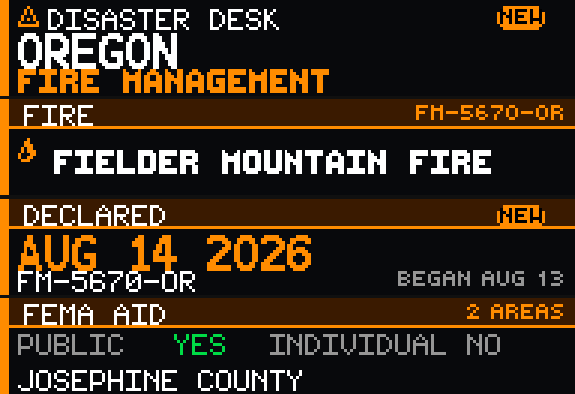

# Disaster Desk

Disaster Desk is a Glance Scroll news app by John McRae. It shows the newest official **FEMA disaster declaration** from [OpenFEMA Disaster Declarations Summaries v2](https://www.fema.gov/openfema-data-page/disaster-declarations-summaries-v2) on a 192×32 panel. No API key is required.



The panel reads like a tiny emergency-operations bulletin: desk identity and declaration type, the incident title, the official declaration date, then FEMA assistance flags and the designated area.

Disaster Desk uses FEMA public data. **It is not an official FEMA application and is not endorsed by FEMA.**

## Preview

From the Glance Developer Network repository:

```powershell
pip install -e .
gdn studio apps/disaster-desk
```

Browser-only preview:

```powershell
gdn preview apps/disaster-desk
```

If `gdn` is not on `PATH`, use `python -m gdn.cli` instead.

## Configuration

| Setting | Default | Notes |
|---------|---------|--------|
| **Area** | `ALL USA` | 50 states, DC, and territories in the FEMA dataset |
| **Incident** | `ALL` | Optional OpenFEMA `incidentType` filter |

- **ALL USA** — newest unique FEMA declaration anywhere in the United States.
- A state such as **MISSOURI** — newest unique declaration for that state (`state eq 'MO'`).
- **Incident = ALL** — no extra filter.
- Other incident choices match OpenFEMA `incidentType` exactly: Fire, Flood, Hurricane, Severe Storm, Tornado, Tropical Storm, Typhoon, Winter Storm. **Hurricane is not Typhoon.**

Panel size is **192×32**. Refresh is **1800 seconds**.

## Pages

| Page | Contents |
|------|----------|
| **alert** | **DISASTER DESK**, state or territory, official declaration type |
| **incident** | FEMA incident type, fitted declaration title, declaration string |
| **declared** | Official `declarationDate`, declaration number, incident begin date when it differs |
| **aid** | Public / Individual assistance flags from the dataset, plus designated area |

## How the latest declaration is chosen

OpenFEMA’s Disaster Declarations Summaries dataset is **one row per designated area** (county, parish, reservation, municipio). Several rows can share the same `disasterNumber`.

Disaster Desk does **not** treat those rows as separate disasters.

1. One `http.get` asks OpenFEMA for 20 rows, already sorted:
   `$orderby=declarationDate desc,disasterNumber desc`
2. Optional server-side filters: `state eq 'MO'` and/or `incidentType eq 'Fire'`
3. The first row is the newest declaration. Every other fetched row with the **same** `disasterNumber` is merged into that one disaster (assistance flags are OR’d; designated areas are counted).
4. Later `disasterNumber` values in the same page are ignored.

A declaration from months or years ago is shown with its **real official date**. The panel does not say CURRENT, ACTIVE, or ONGOING. **NEW** appears only when `declarationDate` is within **2 calendar days** of `ctx.now` (UTC). **DECLARED TODAY** appears only when that date is the same UTC calendar day.

## Declaration types

FEMA `declarationType` is the source of truth. Color is identification, not a severity ranking.

| Code | Panel | Accent |
|------|-------|--------|
| **DR** | MAJOR DISASTER | red |
| **EM** | EMERGENCY | amber |
| **FM** | FIRE MANAGEMENT | orange |
| other / missing | DECLARATION | sky blue |

## Assistance flags

Page 4 reports only what OpenFEMA provides:

- **Individual** — `ihProgramDeclared` or `iaProgramDeclared` (FEMA’s documented rule for Individual Assistance)
- **Public** — `paProgramDeclared`
- **HM YES** — shown only when `hmProgramDeclared` is true

Flags can differ by designated area. The app ORs the flags from the fetched rows of that `disasterNumber`. It does not invent eligibility.

## Data source

Official, keyless OpenFEMA JSON:

```text
https://www.fema.gov/api/open/v2/DisasterDeclarationsSummaries
```

Dataset: **Disaster Declarations Summaries v2**. FEMA documents an update frequency of about every 20 minutes (`R/PT20M`). No API key is used.

Fields read: `disasterNumber`, `state`, `declarationType`, `declarationDate`, `incidentType`, `declarationTitle`, `incidentBeginDate`, `designatedArea`, `ihProgramDeclared`, `iaProgramDeclared`, `paProgramDeclared`, `hmProgramDeclared`, `femaDeclarationString`.

A FEMA declaration in this dataset is a historical Stafford Act record. It does **not** mean the hazard is occurring right now.

## Refresh and caching

- Panel **refresh**: 1800 seconds
- OpenFEMA **TTL**: 1800 seconds

GDN caps uncached `http.get` calls at 8 per render. The default path uses **1 request**. Cached responses are reused across the four pages.

## Errors and empty states

The panel always draws something:

- Network down / timeout / bad JSON → `FEMA DATA UNAVAILABLE`
- Query returned no rows → `NO MATCHING DECLARATIONS`
- Missing title → incident type, then `FEMA DECLARATION`
- Missing date → `DATE UNKNOWN`
- Missing area → `AREA NOT LISTED`

```powershell
gdn render apps/disaster-desk --input "area=ALL USA"
gdn render apps/disaster-desk --input "area=MISSOURI"
gdn render apps/disaster-desk --input "area=FLORIDA"
gdn render apps/disaster-desk --input "area=CALIFORNIA"
gdn render apps/disaster-desk --input "area=TEXAS"
gdn validate apps/disaster-desk
```

## Current technical limitations

- Fonts are **uppercase only**. Frames are **still images** (no scroll/animation); the next refresh shows new data.
- Outbound `http.get` times out at 4 seconds, does not follow redirects, and truncates bodies over 2 MB.
- The app fetches 20 designated-area rows for the newest disaster. If a declaration covers more than 20 areas, the count shows as `20+ AREAS`.
- Long FEMA titles are fitted: full title, then a 2-line wrap, then limited abbreviation (`STRAIGHT-LINE WINDS` → `WINDS`), then ellipsis. Meaning is not rewritten.
- `ctx.now` is UTC, so **TODAY** / **NEW** follow the UTC calendar date of `declarationDate`.
- This is **not** an official FEMA application.

## Informational disclaimer

Disaster Desk is informational. It reports what OpenFEMA published. It is not an emergency alert system, not a substitute for local emergency management, and not advice about evacuation, assistance applications, or safety.

Do not rely on this panel alone to decide whether a hazard is occurring or whether you are eligible for FEMA aid.

## Roadmap

Practical with the same official source — **not built yet**.

- Latest 5 unique declarations
- Rotate recent disasters
- County / designated-area view
- Home-state watch
- Declaration-type filter
- Individual Assistance only / Public Assistance only
- Fire-management-only mode
- Declaration counts this month or year
- Historical disaster mode / state history
- Nearby declarations from a ZIP code
- Alert when a new `disasterNumber` appears

## Accuracy

This app reports what OpenFEMA published in Disaster Declarations Summaries v2. It does not scrape news sites, social media, Wikipedia, or third-party disaster aggregators, and it does not use a model to decide whether a disaster was declared.

## Originality and attribution

The page structure and Starlark drawing code were created for this app. Declaration facts come only from official OpenFEMA data.

Built for the [Glance Developer Network](https://github.com/glance-led-dev/glance-dev-network).
