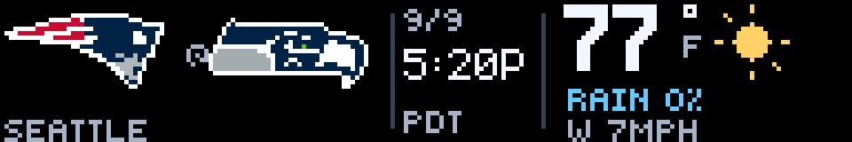

# Game Day Weather

Game Day Weather is a 192×32 SCROLL app for NFL matchups: team marks, stadium-local kickoff (or live score), and outdoor weather at the venue.



## Preview

From the Glance Developer Network repository:

```powershell
pip install -e .
gdn studio apps/game-day-weather
```

Browser-only preview:

```powershell
gdn preview apps/game-day-weather
```

If `gdn` is not on `PATH`, use `python -m gdn.cli` instead. Keep `app.star`, `manifest.yaml`, `assets/`, and `preview/` together. No API keys are required.

## Settings

| Input | What it does |
|------|----------------|
| **Follow a team** | Any NFL club, or `ALL`. `ALL` prefers a live game, otherwise the next kickoff. A team pick follows that club’s next eligible game within 21 days (bye weeks included). Finished, cancelled, and postponed games are skipped. |
| **Kickoff time zone** | `STADIUM LOCAL` (default), `ET`, `CT`, `MT`, `PT`, or `UTC`. Date and time convert together; the zone label sits under kickoff. ET/CT/MT/PT follow daylight saving at the kickoff instant. Weather always stays tied to the stadium and the real kickoff. |
| **Weather units** | `F / MPH` or `C / KMH`. |

Kickoff date is month/day. `P` / `A` is PM/AM. An unconfirmed kickoff shows `TBD` and does not invent a forecast.

## Layout

One page, three zones, 60-second refresh:

| Zone | Contents |
|------|----------|
| **Left** | Away and home marks, `@`, venue city. |
| **Center** | Pregame: date, kickoff, zone. Live: `LIVE`, score, quarter/clock (or `HALFTIME` / `OT`). |
| **Right** | Temperature with °F/°C, weather icon, rain/snow chance, wind. |

Panel size is **192×32**.

## What the weather means

Weather is **outdoors at the venue**, including indoor stadiums. The app does not track roofs or estimate indoor conditions.

- Pregame uses the forecast hour that contains kickoff, not “today.”
- In-game temperature, icon, and wind use current modeled weather when available.
- Precipitation percent is that hour’s forecast probability.
- Snow codes use a `SNOW` label instead of `RAIN`.

## Data sources

At most three HTTP requests per render:

- **Schedule, scores, venue, team identity** — [ESPN](https://www.espn.com/nfl/) public site API (undocumented; availability is not guaranteed). Team marks remain the property of their owners; no NFL or club endorsement is implied.
- **Forecast** — [Open-Meteo](https://open-meteo.com/), CC BY 4.0. The free hosted endpoint is intended for noncommercial use.
- **Venue point** — [Esri World Geocoding](https://developers.arcgis.com/rest/geocode/find-address-candidates/). Only high-confidence point-of-interest matches are used. A city-center pin is never silently substituted for the stadium.

Caches: scores 60s, weather 900s, venue lookup 24h. Live scores are feed snapshots, not a play-by-play clock. After a game completes, the app advances to the next eligible matchup.

## Assets

Bundled native PNGs with binary transparency (no scaling at draw time):

- Most clubs: **36×22**
- Kansas City: **40×26**, majority-sampled from the official arrowhead (white / Chiefs red / black)
- Dallas: **36×26** star with navy outer ring, white inner ring, navy fill

Catalog images: `preview/gameday.png` and `preview/preview.png`.

## Errors and empty states

| Situation | Panel |
|-----------|--------|
| Scores feed down | `SCORES OFFLINE` / `CHECK CONNECTION / RETRY SHORTLY` |
| No game in the 21-day window | `NO UPCOMING GAME` |
| Unknown team setting | `UNKNOWN TEAM` / `CHOOSE AN NFL TEAM IN SETTINGS` |
| Weather missing | `WEATHER` / `UNAVAILABLE` / `CHECK LATER` |
| Kickoff beyond the forecast window | `FORECAST` / `SOON` / `CHECK LATER` |

```powershell
gdn render apps/game-day-weather --input "team=DEN"
gdn validate apps/game-day-weather
```

## Limits

- Relies on ESPN’s public scoreboard remaining reachable.
- Open-Meteo’s free host is noncommercial; catalog/commercial use needs an appropriate plan or another forecast source.
- US and a few European venue zones handle DST at kickoff; anything else falls back to labelled UTC.
- Frames are still. The panel updates on the 60s refresh timer.

Built for the [Glance Developer Network](https://github.com/glance-led-dev/glance-dev-network).
