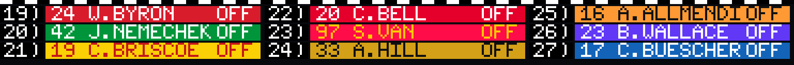

# Motorsports Live

Motorsports Live is a live broadcast style leaderboard for NASCAR Cup, O'Reilly's, Trucks, and Formula 1, as well as a next race preview for when there is no live session.

While a session is live: users will see a series logo, event info, flag state, current lap/stage, and a rotating full-field board with car numbers, gaps to the leader, and playoff/chase status (NASCAR only).

When a session is no longer live: users will see the next scheduled race — track, date, and time (selectable time zone), and track layout. The date & time is a customizable color.



## Preview

From the GLANCE Developer Network repository:

```powershell
pip install -e .
gdn studio apps/motorsports-live
```

The browser-only preview is also available with:

```powershell
gdn preview apps/motorsports-live
```

If the `gdn` executable is not on `PATH`, use `python -m gdn.cli` in its place.

## Configuration

- **Series** — NASCAR Cup, the O'Reilly Auto Parts Series, the Craftsman Truck Series, or Formula 1.
- **Time zone** — race dates/times are shown in this zone.
- **Next-race date/time color** — color of the date/time text on the off-session "next race" card.

Built for the [GLANCE Developer Network](https://github.com/glance-led-dev/glance-dev-network).
