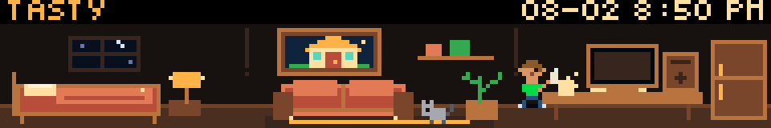

# Pixel Residents

Pixel Residents is an original GLANCE Scroll app by John McRae. A tiny configurable resident lives in one continuous side-view apartment, moving between a bedroom, living room, and kitchen/work area as the local day progresses.



## Preview

From the GLANCE Developer Network repository:

```powershell
pip install -e .
gdn studio apps/pixel-residents
```

The browser-only preview is also available with:

```powershell
gdn preview apps/pixel-residents
```

If the `gdn` executable is not on `PATH`, use `python -m gdn.cli` in its place.

## Configuration

- **Character name** — converted to uppercase and measured with the bitmap font before display.
- **Personality** — `COZY`, `BUSY`, `LAZY`, `GAMER`, `BOOKWORM`, or `RANDOM`.
- **Shirt color / Hair color** — native color controls.
- **Skin tone** — `LIGHT`, `MEDIUM`, `TAN`, or `DARK`.
- **Room theme** — `COZY`, `MODERN`, `ARCADE`, `CABIN`, or `NIGHT`.
- **Enable pet / Pet type** — optional original cat or dog.
- **Display clock** — shows the selected timezone's date and time.
- **Timezone** — fixed UTC offsets from `UTC-12` through `UTC+14`.
- **Room lights** — automatic schedule lighting or a manual on/off override.
- **PC power** — activity-controlled power or a manual on/off override.
- **Message override** — leave blank for rotating activity messages from the resident, or enter a custom uppercase message.
- **Schedule** — `NORMAL`, `EARLY BIRD`, or `NIGHT OWL`.
- **Resident action** — directly wave, dance, make coffee, play a game, read, water the plant, call/feed/play with the pet, settle the pet for a nap, or go to bed. `AUTO ROUTINE` restores the schedule.

## Daily behavior

The normal schedule uses these periods in the selected timezone:

- `00:00–05:59` — sleep.
- `06:00–07:59` — wake, breakfast, coffee, or an early walk.
- `08:00–11:59` — work, read, walk, clean, play, or relax.
- `12:00–13:59` — lunch, sitting, walking, or pet time.
- `14:00–17:59` — work, hobbies, plant care, walking, or pet time.
- `18:00–20:59` — dinner, reading, games, relaxation, or pet time.
- `21:00–22:59` — wind down and prepare for bed.
- `23:00–23:59` — sleep.

`EARLY BIRD` advances that routine by two hours. `NIGHT OWL` delays it by three hours. Personality changes the weighted activity pool within each period: cozy residents favor coffee, plants, and the couch; busy residents work, walk, and clean; lazy residents nap and sit; gamers favor screens and controllers; bookworms favor books and warm seating; random residents use the broadest pool.

The selected activity is stable for a five-minute slot. A time-derived frame controls walking direction and pose, screen pixels, steam, lamp accents, water drops, sleep pixels, and pet details without random flicker.

The bedroom window follows local time: sunrise colors at 06:00, blue sky from 07:00–18:59, sunset at 19:00, and a moon-and-stars view overnight.

Seasonal decor follows the selected timezone's local date. New Year's Eve adds gold lights, fireworks, and confetti; New Year's Day adds a `HAPPY NEW YEAR` message and celebration decor. Valentine's Day adds hearts and pink-red lights. Easter is calculated for each Gregorian year and adds pastel eggs, bunting, and a bunny. July 4 adds a flag, patriotic lights, and fireworks. October adds Halloween garland, a jack-o-lantern, bats, and a cobweb. U.S. Thanksgiving is calculated as November's fourth Thursday and adds autumn garland, a turkey, and dinner. December adds snow, animated holiday lights, a stocking, and a decorated Christmas tree.

## Direct interaction

Use **Resident action** to command the resident. The selected command remains active until it is changed back to `AUTO ROUTINE`, because GDN settings do not provide momentary button events.

The resident uses the top-left bar for short contextual messages such as `HELLO THERE`, `COFFEE TIME`, `CHECKING MAIL`, and `HIGH SCORE`. Messages change deterministically with the current activity and frame.

During `AUTO ROUTINE`, the resident replaces its activity message with a polite, uplifting note for five minutes every half hour. Examples include `YOU GOT THIS`, `PROUD OF YOU`, and `ONE STEP AT A TIME`.

Personality also influences occasional Auto Routine dialogue: gamers discuss levels, bookworms mention books, cozy residents mention coffee, busy residents encourage progress, and lazy residents favor relaxed messages.

When pet mode is enabled, the pet independently chooses between several safe floor locations during Auto Routine and sometimes naps instead of always following the resident.

Command-line example:

```powershell
gdn render apps/pixel-residents --input "previewmode=PLAY GAME" --now 2026-07-30T18:42:15
gdn validate apps/pixel-residents
```

## Current technical limitations

- GDN apps have no persistent per-user storage API. The resident does not remember events, accumulate needs, or permanently change the room.
- The supported public refresh minimum is 60 seconds. Second-derived frames are visible in Studio's live preview, while a device normally receives one deterministic sample per refresh.
- `ctx.now` supplies reliable UTC time. The selected fixed offset controls the displayed date/time and schedule; daylight saving changes must be selected manually.
- The app renders complete independent frames. It does not use loops, threads, sleeps, browser animation, external APIs, or hidden state.
- All art is procedural Starlark pixel art; no image or sound assets are required.

## Roadmap

Optional future work includes named timezones with automatic daylight saving rules, additional original furniture and pet poses, seasonal palettes, more resident activities, and long-term room progression if GDN adds an official persistence mechanism.

## Originality and attribution

All code, character sprites, pet sprites, room designs, palettes, names, animations, and behavior in Pixel Residents were created specifically for this app. It does not copy third-party artwork, layouts, text, sounds, characters, or assets.

Built for the [GLANCE Developer Network](https://github.com/glance-led-dev/glance-dev-network).
