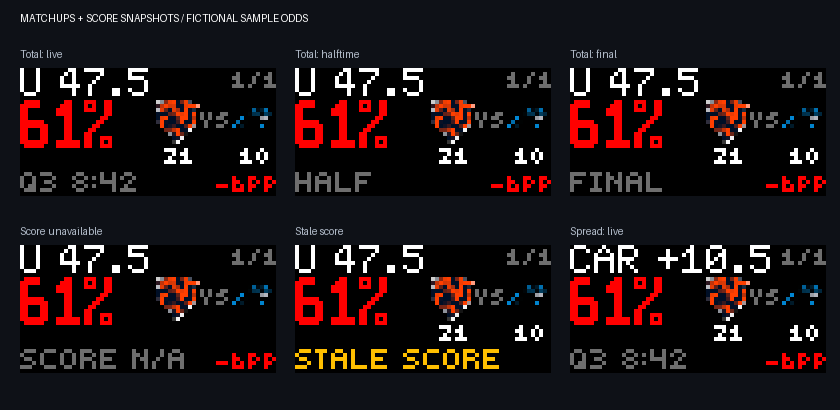

# Prediction Market Ticker

Keep your prediction market positions in view while you watch the game. Prediction Market Ticker shows one market at a time on a 64 × 32 Glance display, with large odds, matchup logos, scores and game-clock snapshots. Spread positions show the team and signed line you effectively hold: NO on Pittsburgh winning by more than 10.5 becomes Atlanta +10.5 in an Atlanta–Pittsburgh matchup.

**Requires your own feed URL.** You can connect an existing compatible feed or host the included Kalshi connector. Installing this Glance app does not automatically connect a trading account.

*Examples use sample odds, not a live account.*

## What the display means

| On screen | Meaning |
|---|---|
| Market label | The market or team you are following, with a threshold when supplied by the feed. |
| Signed line, such as `CAR +10.5` | Your effective spread and held team. |
| `O 47.5` / `U 47.5` | Over / under the game total. Two logos to the right of the odds identify the matchup. |
| Large percentage | The feed's estimated probability for the side you hold. |
| Green / red / white odds | Probability increased / decreased / stayed unchanged or has no previous value. |
| `-6PP` | Change in **percentage points**. A move from 67% to 61% is −6 points. Shown when space allows. |
| Numbers under the logos | Each team's score, in the same left-to-right order as the logos. |
| `Q3 8:42`, `HALF`, `OT1`, `FINAL` | The latest game snapshot. Market statuses such as WON or CLOSED take priority. |
| `2/6` | Position 2 of the 6 included by your settings, sorted by market ticker. |

This is a view of market probabilities. It does not show account value or profit/loss, and it does not place trades.

## What you need

- A Glance display with a 64 × 32 layout.
- A compatible JSON feed reachable over the internet by Glance's render service.
- For the included Kalshi connector: your own Kalshi API key and a hosted server. Hosting is separate from the Glance app and may incur charges.

## Get started

1. Add **Prediction Market Ticker** from the Glance app catalog once it is available.
2. Open its settings and paste your JSON feed address into **Feed URL**. Use the JSON endpoint, not a website or PNG image address.
3. Leave **League for older feeds** set to **Auto** unless your feed provider tells you otherwise.
4. Save the settings and enable the app in your display rotation.

The app requests a refresh every 60 seconds. Scores and the game clock are snapshots, not a continuously ticking clock. ESPN may lag the broadcast, and Glance's display schedule can delay a refresh. The app does not estimate clock movement between updates.

## Choose what appears

With the included version 2 feed, open the app settings:

- **Position display:** Rotate through your list, or Pin one position.
- **Minutes per position:** Choose 1, 2, 3 or 5. Every position continues fetching data once per minute while pinned or held.
- **Show positions:** All positions, NFL, CFB or Live games.
- **Choose specific positions:** Optionally paste comma-separated market tickers from the feed's `rows[].ticker` fields. Leave blank for all.
- **Pinned position number:** Enter the number shown in the counter within the current filtered list. Changing filters or holdings can change that number; select one exact ticker to keep following one particular market.
- **Scores and game clock:** Show or hide the score snapshot.

Save and allow the next refresh. Rotation uses clock time, so scheduling gaps may skip a position. Older feeds without `version: 2` keep the original layout and first-row rotation; update the connector to enable these controls.

**Need a feed?** Follow [Set up your own Kalshi feed](SETUP-KALSHI.md). The server files are included in [feed-server](feed-server/), so you do not need the app author's server or account.

**Already have a feed or use another provider?** Share the [feed format](FEED-FORMAT.md) with whoever maintains it. Other prediction market services need an adapter that produces this format; they do not connect automatically.

## Team logos

The app includes all 32 NFL teams and 70 college football teams: the ACC, Big Ten, Big 12 and SEC football programs, the remaining historic Pac-12 schools, and Notre Dame. That covers the historic Power Five and newer power-conference additions. See the [full team list and artwork sources](ASSET-SOURCES.md).

Logos are bundled and rendered on a 12 × 12 grid for matchups or 16 × 16 for single-team views. Unsupported teams use short text codes. Unknown matchups never receive guessed logos.

New feeds identify the league and team automatically. For older feeds containing only one league, choosing **NFL** or **CFB** resolves shared abbreviations such as PIT. Mixed NFL/college feeds should include team metadata. For spreads, YES shows the named team minus the line; NO shows the opponent plus the line. The odds still reflect the YES or NO contract you hold. If the connector cannot resolve the matchup, it displays an explicit YES/NO label and does not guess the opposing team. Other binary markets retain the named team.

## Troubleshooting

| What you see | What to check |
|---|---|
| SET FEED / URL | Enter and save your feed address. |
| FEED / ERROR | Open the feed URL in a browser. It must return JSON successfully; check that your server is running and its account credentials are valid. |
| NO OPEN / MARKETS | The feed returned an empty list. With the Kalshi connector, check for nonzero positions in the account connected to that key. |
| `--%` | The feed has no available probability for this market. |
| YES/NO instead of a signed spread | The connector could not resolve the matchup or threshold reliably. Check the full market contract. |
| No team logo | The team may be unsupported or ambiguous. Use team metadata, or choose the league for an older single-league feed. |
| The same market repeats | Check Pin one, Minutes per position, and your filters. Older feeds must rotate their first row on the server. |
| NO MATCH / FILTERS | No held positions match your filters or chosen tickers. Clear the filters or select All positions. |
| BAD PICK / CHECK PIN | Enter a pinned number between 1 and the number of filtered positions. |
| SCORE N/A | ESPN is unavailable or the connector cannot uniquely match the game. Odds continue to work. |
| STALE SCORE / STALE FEED | The last snapshot is old or a scoreboard request failed. The clock remains the last fetched value. |
| Changes appear slowly | Refreshes are scheduled, rather than continuous. Allow the next app refresh and check the feed server if data remains old. |

Keep API private keys on your feed server. The Glance app only needs the feed URL. The included connector serves its market rows without a login, so anyone who can reach that URL can read those rows; do not use the author's or another user's account feed as your own.

For developers and contributors, see [DEVELOPMENT.md](DEVELOPMENT.md).
