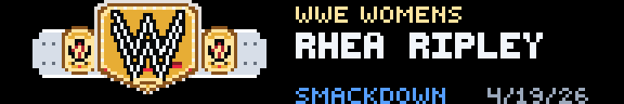
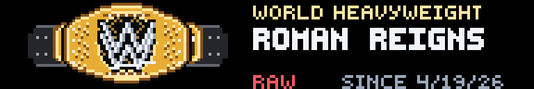
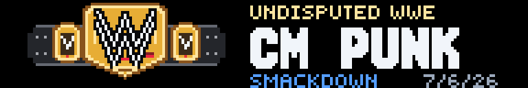
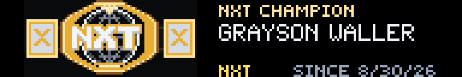
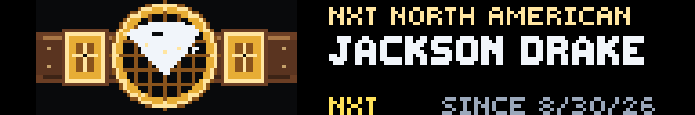
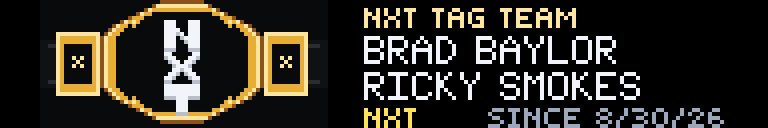
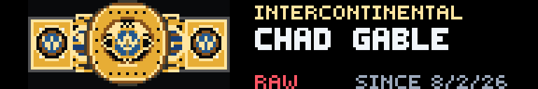
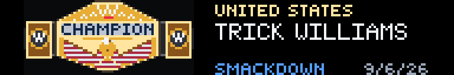

# WWE Champions

One championship belt beside the person who holds it. Native pixel art, black
ground, gold metal — built to read from across the room on a 192×32 SCROLL panel.


The plate is the hero. Title, champion, brand, and the date they won sit in the
text column to the right. Live names and win dates come from Wikipedia; the
belts are drawn pixel-by-pixel from the real hardware, not scaled photos.

## Belts

Each title keeps its own silhouette, strap, and logo. These are live frames:

| Title | Panel |
|-------|--------|
| WWE Women's |  |
| World Heavyweight |  |
| Undisputed WWE |  |
| NXT |  |
| NXT North American |  |
| NXT Tag Team |  |
| Intercontinental |  |
| United States |  |

Raw, SmackDown, NXT, Evolve, ID, and the cross-brand women's tag title are all
in the rotation. Women's straps stay white; NXT plates stay hexagonal; the
North American globe stays on brown leather.

## Settings

| Input | What it does |
|------|----------------|
| **Brand** | `ALL`, `RAW`, `SMACKDOWN`, `NXT`, `OPEN`, `EVOLVE`, `ID`, or `DEV`. `OPEN` is the cross-brand women's tag title. `DEV` combines OPEN, Evolve, and ID. |
| **Title** | `ROTATE` walks the selected brand once a minute. Pick a title to pin it. Set Brand to `ALL` if the title you want is on another brand. |

## Layout

192×32, 60-second refresh, one still frame:

| Zone | Contents |
|------|----------|
| **Belt** (x 10–81) | Full plate, strap, side plates. Safe-zone padding on the scroll edges. |
| **Gutter** | Black gap so metal never collides with type. |
| **Type** (x 91–181) | Gold title, silver champion (two tag members when the feed has both), brand color on the left of the footer, win date on the right. |

Brand footers spell the show out (`SMACKDOWN`, `RAW`, `NXT`, …) in that brand's
color. When the name is short enough, the date reads `SINCE 5/4/26`. Longer
brands (SmackDown) drop `SINCE` and keep `4/19/26` so the row never collides.

Long singles names step down a font ladder, then two lines, then an explicit
`..` clip. Frames are still images; the panel redraws on the refresh timer.

## Data

No API key. Champion and date-won come from the MediaWiki parse of
[List of current champions in WWE](https://en.wikipedia.org/wiki/List_of_current_champions_in_WWE).

- Feed cache: 30 minutes
- Title rotation: 60 seconds
- User-Agent is required by Wikipedia and is set in the app

Wikipedia can lag a title change, and a table-markup change can break the
parser. A brand-new championship uses a generic WWE plate until its artwork is
added.

## Errors and empty states

| Situation | Panel |
|-----------|--------|
| Wikipedia unreachable | `FEED OFFLINE` / `TRY AGAIN LATER` |
| Brand/title combo empty | `NO TITLE FOUND` / `SET ALL / ROTATE` |
| Bad brand setting | `BAD BRAND` / `CHOOSE A BRAND` |

```powershell
pip install -e .
gdn studio apps/wwe-champions
gdn preview apps/wwe-champions
gdn render apps/wwe-champions --input "brand=SMACKDOWN" --input "title=WWE WOMEN'S"
gdn validate apps/wwe-champions
```

If `gdn` is not on `PATH`, use `python -m gdn.cli` instead. Keep `app.star`,
`manifest.yaml`, and `preview/` together.

Built for the [Glance Developer Network](https://github.com/glance-led-dev/glance-dev-network).
