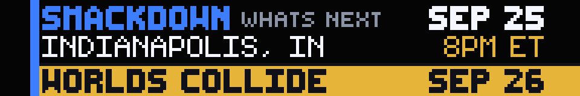

# WWE What's Next

Upcoming RAW, SmackDown, and NXT cards on a native **192×32** SCROLL panel.
Overview, announced matches, and optional previous-show results — still frames,
no portraits, no animation.

The overview is the event plate: brand, city, time, match count, and the next
Premium Live Event on a gold bar. Match pages put names in the hero slot.
Championship bouts reuse the WWE Champions 72×32 belt art.

## Settings

| Input | What it does |
|------|----------------|
| **Show** | `AUTO` picks the earliest dated future card. Pin `RAW`, `SMACKDOWN`, or `NXT`. |
| **Show Previous Results** | `ON` adds pages for the last completed show of that brand: main event plus title matches. |

## Pages

1. **Overview** — brand, date, city, start time, next PLE.
2. **Card 1–4** — announced matches, title bouts with belts, packed “to speak” segments.
3. **Results 1–3** — previous main event and championships, when Results is on.

Empty and missing cards show **CARD UNAVAILABLE**. Invalid settings show
**CHECK SETTINGS**.

## Data

Live lineups come from dated Fightful and F4W RSS posts. City and the next PLE
are filled from WWE.com events when the card omits them. Weekly TV without a
listed time is shown as **8PM ET**. Coverage follows what those feeds publish,
not a complete WWE calendar.

Refresh is 30 minutes. HTTP cache is 900 seconds. No API key.
